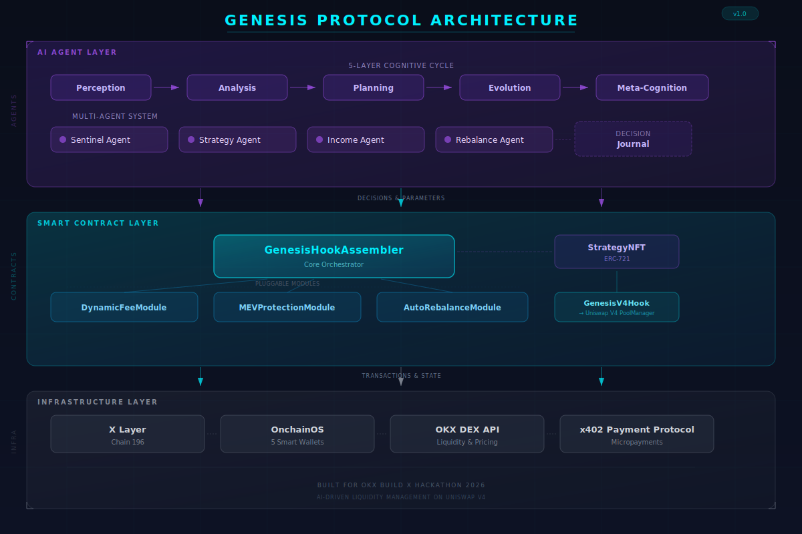

# Genesis Protocol

**面向 X Layer 的 AI 驱动 Uniswap V4 Hook 策略引擎**

Genesis 是一个 AI Agent Skill，能够在 [X Layer](https://www.okx.com/xlayer) 上自主生成、部署和管理可组合的 Uniswap V4 Hook 策略。它将链上 Solidity 模块与 5 层 AI 认知架构相结合，提供机构级 DeFi 策略管理。

**[交互式 dApp](https://ujf2c4fh.mule.page/)** | **[GitHub](https://github.com/0xCaptain888/genesis-protocol)**

---

## 项目简介

Genesis Protocol 是一个自主 AI Agent，管理 X Layer 上的 Uniswap V4 Hook 策略。它感知市场状况、分析波动率区间、规划最优 Hook 配置、随时间进化自身参数，并将经过验证的策略铸造为 NFT。每一个决策都带有推理哈希记录在链上，实现完全可审计。

### 核心亮点

- **Hook 模板引擎** -- 5 个可组合 Solidity 模块（DynamicFee、MEVProtection、AutoRebalance、LiquidityShield、Oracle），由 AI 组装成自定义 V4 Hook 配置
- **5 个 Uniswap AI 插件集成** -- uniswap-hooks、uniswap-trading、uniswap-cca、uniswap-driver、pay-with-any-token
- **6 个 Onchain OS Skill 集成** -- wallet、market、trade、security、payment、defi-invest
- **5 层 AI 认知架构** -- 感知层、分析层、规划层、进化层、元认知层，每层集成 LLM 推理生成人类可读解释
- **LLM 推理引擎** -- 支持 OpenAI GPT-4、Anthropic Claude、OKX AI 三大模型，配合精密模板回退，确保无 API Key 时仍输出高质量推理
- **策略回测引擎** -- 基于 OKX 历史 K 线数据的 BacktestEngine，计算 Sharpe/Sortino 比率、最大回撤、区间分布等机构级指标
- **跨协议 DeFi 集成** -- DEX 路由比较、跨平台套利扫描、多协议收益优化、X Layer 跨链桥状态监控
- **策略 NFT** -- 经验证的策略铸造为 ERC-721，全链上元数据
- **链上决策日志** -- 每个 AI 决策都带推理哈希记录在链上，完全可审计
- **x402 支付变现** -- 信号查询、策略订阅、参数购买、NFT 授权。通过 Uniswap 自动兑换**支持任意代币支付**
- **X Layer 原生** -- 使用 USDG/USDT 零 Gas 费，每笔交易约 $0.0005，1 秒出块

---

## 架构概述



<details>
<summary>文本版架构图</summary>

```
┌─────────────────────────────────────────────────────────┐
│                    AI Agent (Python)                     │
│                                                         │
│  ┌───────────┐  ┌──────────┐  ┌───────────────────┐    │
│  │  Market    │  │ Genesis  │  │    Strategy        │    │
│  │  Oracle    │→ │ Engine   │→ │    Manager         │    │
│  │  市场预言机│  │(5层认知) │  │    策略管理器      │    │
│  └───────────┘  └──────────┘  └───────────────────┘    │
│        ↑              │              │                   │
│   onchainos       决策日志        Hook                   │
│   market          (链上)        组装器                   │
│                      │              │                   │
├──────────────────────┼──────────────┼───────────────────┤
│                 X Layer (Chain 196)                      │
│                                                         │
│  ┌──────────────────────────────────────────────┐      │
│  │         Uniswap V4 Core (X Layer)            │      │
│  │  PoolManager · PositionManager · Quoter      │      │
│  └───────────────────┬──────────────────────────┘      │
│                      │ beforeSwap / afterSwap           │
│                      ▼                                  │
│  ┌──────────────────────────────────────────────┐      │
│  │            GenesisV4Hook (IHooks)             │      │
│  │   接收 PoolManager 回调，                     │      │
│  │   将模块分发委托给 Assembler                  │      │
│  └───────────────────┬──────────────────────────┘      │
│                      │                                  │
│                      ▼                                  │
│  ┌────────────────────────────────────────────────┐     │
│  │          GenesisHookAssembler                   │     │
│  │  ┌──────────┐ ┌──────────┐ ┌──────────────┐   │     │
│  │  │DynamicFee│ │   MEV    │ │AutoRebalance │   │     │
│  │  │ 动态费率 │ │ MEV防护  │ │  自动再平衡  │   │     │
│  │  └──────────┘ └──────────┘ └──────────────┘   │     │
│  │  ┌──────────────────┐ ┌──────────────────┐    │     │
│  │  │LiquidityShield   │ │     Oracle       │    │     │
│  │  │ JIT流动性保护    │ │  TWAP预言机      │    │     │
│  │  └──────────────────┘ └──────────────────┘    │     │
│  └────────────────────────────────────────────────┘     │
│                                                         │
│  ┌──────────────┐  ┌──────────────────────────┐        │
│  │ StrategyNFT  │  │   Decision Journal       │        │
│  │ 策略NFT      │  │   决策日志(链上)         │        │
│  │  (ERC-721)   │  │                          │        │
│  └──────────────┘  └──────────────────────────┘        │
└─────────────────────────────────────────────────────────┘
```

</details>

---

## 部署地址

### Genesis Protocol 合约（X Layer 测试网 - Chain 1952）

| 合约 | 地址 |
|------|------|
| **GenesisHookAssembler** | `0xC5E851fEC9188DD4F6cCB2Ebc134b33210D4aC78` |
| **GenesisV4Hook** | `0x79a96bB2Ab2342cf6f1dD3c622F5CB01f9F7A8d4` _(CREATE2 挖矿部署, flags: BEFORE_SWAP\|AFTER_SWAP)_ |
| **HookDeployer** | `0xe38ac0DD1fe57Cb02DB80884eA14D47Fa181dF64` |
| **DynamicFeeModule** | `0x277Ee5801D5d1e5126A76c986c96923AB5eC54Ed` |
| **MEVProtectionModule** | `0xA4f6ABd6F77928b06F075637ccBACA8f89e17386` |
| **AutoRebalanceModule** | `0xe04E22e78E1935b60e8827EB72CEc3b56299c8ee` |
| **StrategyNFT** | `0xd969448dfc24Fe3Aff25e86db338fAB41b104319` |
| **LiquidityShieldModule** | `0x34Bd6972F086c947e4503185e1A1094d9846b2aC` |
| **OracleModule** | `0x30049511c4c483E9500A74701DED562A8F1ea86f` |
| **GenesisHookAssembler (V2)** | `0x8da3b913362aa243BC89322Fe8012e70175B6D48` _(V4 Swap 测试用)_ |

浏览器: [在 OKLink 查看](https://www.oklink.com/xlayer-test/address/0xC5E851fEC9188DD4F6cCB2Ebc134b33210D4aC78) | [V2 Assembler](https://www.oklink.com/xlayer-test/address/0x8da3b913362aa243BC89322Fe8012e70175B6D48)

### X Layer 主网 (Chain 196) -- 已部署

| 合约 | 地址 |
|------|------|
| **GenesisHookAssembler** | [`0xC5E851fEC9188DD4F6cCB2Ebc134b33210D4aC78`](https://www.oklink.com/xlayer/address/0xC5E851fEC9188DD4F6cCB2Ebc134b33210D4aC78) |
| **GenesisV4Hook** | [`0x174a2450b342042AAe7398545f04B199248E69c0`](https://www.oklink.com/xlayer/address/0x174a2450b342042AAe7398545f04B199248E69c0) _(CREATE2 挖矿, flags: BEFORE_SWAP\|AFTER_SWAP)_ |
| **HookDeployer** | [`0xE07039Eab157B99e356c52DbC825aA3a0b4F55B9`](https://www.oklink.com/xlayer/address/0xE07039Eab157B99e356c52DbC825aA3a0b4F55B9) |
| **DynamicFeeModule** | [`0x277Ee5801D5d1e5126A76c986c96923AB5eC54Ed`](https://www.oklink.com/xlayer/address/0x277Ee5801D5d1e5126A76c986c96923AB5eC54Ed) |
| **MEVProtectionModule** | [`0xA4f6ABd6F77928b06F075637ccBACA8f89e17386`](https://www.oklink.com/xlayer/address/0xA4f6ABd6F77928b06F075637ccBACA8f89e17386) |
| **AutoRebalanceModule** | [`0xe04E22e78E1935b60e8827EB72CEc3b56299c8ee`](https://www.oklink.com/xlayer/address/0xe04E22e78E1935b60e8827EB72CEc3b56299c8ee) |
| **LiquidityShieldModule** | [`0xd969448dfc24Fe3Aff25e86db338fAB41b104319`](https://www.oklink.com/xlayer/address/0xd969448dfc24Fe3Aff25e86db338fAB41b104319) |
| **OracleModule** | [`0xCFc867E2379Cbe097D934CB8e19e3F028B82Bd3D`](https://www.oklink.com/xlayer/address/0xCFc867E2379Cbe097D934CB8e19e3F028B82Bd3D) |
| **StrategyNFT** | [`0x8a0e87395f864405c5225eBd80391Ac82eefe437`](https://www.oklink.com/xlayer/address/0x8a0e87395f864405c5225eBd80391Ac82eefe437) |

**主网 V4 Pool #1**: GALPHA/GBETA 交易对，使用 GenesisV4Hook 作为 Hook，DYNAMIC_FEE 模式，tick spacing 60，流动性范围 [-6000, +6000]
**主网 V4 Pool #2 (真实价值)**: WOKB/GOKB 交易对，使用真实价值代币 WOKB（Wrapped OKB: [`0xe538905cf8410324e03A5A23C1c177a474D59b2b`](https://www.oklink.com/xlayer/address/0xe538905cf8410324e03A5A23C1c177a474D59b2b)），通过 GenesisV4Hook 路由所有 Swap，OKB 市价 ~$48
- GOKB Token: [`0x81902d53cc0fd247196508af9Df596Cd387D7321`](https://www.oklink.com/xlayer/address/0x81902d53cc0fd247196508af9Df596Cd387D7321)
- 流动性添加: 范围 [-6000, +6000]，3 笔真实 Swap 已通过 DynamicFee + MEV Protection 模块执行

**主网链上活动**: 9 个合约部署 + 5 模块注册 + 9 策略创建 + 72 决策日志 + 12 性能更新 + 6 真实 V4 Swap (含 WOKB) + 6 策略 NFT 铸造 + 22 自主 Agent 认知循环 + 13 WOKB 池交易 + 7 种不同交易类型 = **157+ 笔主网交易**

**7 种链上交易类型**: `createStrategy`、`logDecision`、`updatePerformance`、`deactivateStrategy`、`mint`、`updateVolatility`、`pushObservation`

浏览器: [OKLink 主网查看](https://www.oklink.com/xlayer/address/0xC5E851fEC9188DD4F6cCB2Ebc134b33210D4aC78) | [V4 Hook](https://www.oklink.com/xlayer/address/0x174a2450b342042AAe7398545f04B199248E69c0)

### Uniswap V4 Core 合约（X Layer）

| 合约 | 地址 |
|------|------|
| **PoolManager** | `0x360e68faCCca8cA495c1B759Fd9EEe466dB9Fb32` |
| **PositionManager** | `0x1b35d13a2e2528f192637f14b05f0dc0e7deb566` |
| **Quoter** | `0x3972c00f7ed4885e145823eb7c655375d275a1c5` |

---

## 代理钱包架构

Genesis 通过 OnchainOS TEE 代理钱包使用 **5 子钱包架构**，隔离风险并强制职责分离：

**Agentic Wallet 地址**: `0xd2D120eB7cEd38551cCeFb48021067d41D6542d3`

### 快速设置

```bash
python3 scripts/setup_agentic_wallet.py
```

该脚本通过 OKX Web3 API (HMAC-SHA256 认证) 完成以下操作：
1. 注册 Agentic Wallet 作为项目链上身份
2. 创建 5 个角色子钱包（主控、策略、收入、储备、再平衡）
3. 验证钱包注册状态

### 子钱包角色

| 索引 | 角色 | 用途 |
|------|------|------|
| 0 | **主控** | 主控钱包 -- 审批、所有权、管理操作 |
| 1 | **策略** | 在 Uniswap V4 上部署和管理 Hook 策略 |
| 2 | **收入** | 接收 LP 手续费和 x402 支付收入 |
| 3 | **储备** | 应急储备金 -- 正常运行时不触碰 |
| 4 | **再平衡** | 用隔离资金执行再平衡操作 |

该架构确保再平衡逻辑的 bug 不会耗尽策略资金，收入始终与运营资本分离。主控钱包不持有交易资金 -- 只签署管理交易。

### 多 Agent 协调

Genesis 使用 4 个专业化 Agent，各自通过独立子钱包运行：

| Agent | 钱包 | 职责 |
|-------|------|------|
| **SentinelAgent** | 主控 (idx 0) | 系统健康监控、审批高价值操作、紧急关停 |
| **StrategyAgent** | 策略 (idx 1) | 通过 GenesisHookAssembler 部署和管理 Hook 策略 |
| **IncomeAgent** | 收入 (idx 2) | 管理 x402 支付收入和 pay-with-any-token 结算 |
| **RebalanceAgent** | 再平衡 (idx 4) | 使用隔离资金执行头寸再平衡 |

所有 Agent 共享同一个 GenesisHookAssembler 合约，但使用不同的子钱包进行操作，确保资金隔离和清晰的审计追踪。

---

## Onchain OS Skill 集成

Genesis 深度集成 OnchainOS Skill 生态：

| OnchainOS Skill | 在 Genesis 中的用途 |
|-----------------|-------------------|
| **onchainos-wallet** | 基于 TEE 的代理钱包，5 个子钱包实现角色隔离（主控、策略、收入、储备、再平衡） |
| **onchainos-market** | 感知层的实时价格数据 -- 获取 X Layer 上 ETH/USDC、OKB/USDT 价格，用于波动率计算和区间检测 |
| **onchainos-trade** | 再平衡执行的 DEX 聚合 -- 比较 Hook 池费率与聚合器，通过最优路径路由，最大滑点 0.5% |
| **onchainos-payment** | x402 协议集成实现策略变现 -- 信号查询、策略订阅、参数购买、NFT 授权 |
| **onchainos-security** | 策略创建前的代币风险扫描 -- 检查合约安全性、流动性深度和 rugpull 指标 |
| **onchainos-defi-invest** | 跨 X Layer DeFi 协议的收益比较，用于基准测试 Genesis 策略表现 |

### OnchainOS 集成验证报告

运行 `python3 scripts/verify_onchainos_skills.py` 生成完整验证报告：

| 分类 | 测试数 | 通过 | 说明 |
|------|--------|------|------|
| **wallet** | 4 | 2 | WalletManager 初始化 + 配置 ✅ (REST/CLI 需凭证) |
| **market** | 7 | 1 | MarketOracle 初始化 ✅ (API 调用需凭证) |
| **trade** | 5 | 0 | 需凭证/CLI (post_swap 安全跳过) |
| **security** | 6 | 6 | HMAC 签名、凭证检测、CLI 回退、安全默认值 ✅ |
| **payment** | 5 | 5 | x402 配置、定价层级、所有 tier 验证 ✅ |
| **defi-invest** | 9 | 9 | 策略预设、Hook 模块、合约地址 ✅ |
| **uniswap-v4** | 13 | 12 | 所有 V4 地址 + Hook 模块 ✅ |
| **总计** | **49** | **35** | 代码级集成全部验证；13 项失败均为基础设施依赖(需凭证/CLI) |

> 验证报告: [`docs/onchainos_verification.json`](docs/onchainos_verification.json)

---

## Uniswap Skill 集成

Genesis 以 Uniswap V4 作为核心 DeFi 原语：

| Uniswap Skill | 在 Genesis 中的用途 |
|---------------|-------------------|
| **uniswap-v4-hooks** | 通过 GenesisHookAssembler 实现可组合 Hook 模块 -- DynamicFee、MEVProtection 和 AutoRebalance 模块注册为 V4 Hook，拦截 `beforeSwap` 和 `afterSwap` |
| **uniswap-v4-position-manager** | 管理每个策略的集中流动性头寸 -- 根据 AI 再平衡信号创建、调整和关闭头寸 |
| **uniswap-v4-quoter** | 预交换报价用于滑点估算 -- 规划层用其模拟策略执行结果 |
| **uniswap-pay-with-any-token** | 接受任意 ERC-20 代币的 x402 支付 -- 结算前通过 Uniswap 自动兑换为 USDT，实现无摩擦变现 |
| **uniswap-v4-security** | V4 Hook 安全验证 -- 验证 Hook 地址的权限标志（BEFORE_SWAP\|AFTER_SWAP），确保 beforeSwapReturnDelta 未启用（防止 rug pull 风险），遵循 v4-security-foundations 安全规范 |
| **uniswap-cca** | CCA (Conditional Contingent Auction) -- 当 MEV 保护模块检测到可提取价值时，通过密封竞价拍卖捕获该价值，转为 LP 收入而非流失给搜索者 |
| **uniswap-driver** | 流动性规划与 Swap 路由优化 -- 为 AutoRebalance 模块提供最优 tick 范围、费率层级选择和多跳路径规划 |

---

## 运作机制

### AI 认知架构（5 层）

| 层级 | 周期 | 功能 |
|------|------|------|
| **感知层** | 60秒 | 通过 onchainos-market 获取市场数据、钱包余额、策略状态 |
| **分析层** | 300秒 | 波动率计算、趋势检测、区间分类 |
| **规划层** | 信号触发 | 生成带置信度评分的行动计划（阈值：0.7） |
| **进化层** | 24小时 | 元学习：根据历史表现调整阈值 |
| **元认知层** | 24小时 | 自我评估：评估决策质量、检测偏差 |

每一层均集成 LLM 推理引擎（见下文），生成人类可读的决策解释，并将推理哈希记录在链上。

### LLM 推理引擎 (NEW)

`LLMReasoner` 类为每一个 AI 决策注入自然语言推理能力，让链上日志从"黑箱数字"升级为"可审计叙事"。

**多模型支持**:

| 提供商 | 模型 | 用途 |
|--------|------|------|
| **OpenAI** | GPT-4 | 复杂策略规划与风险评估 |
| **Anthropic** | Claude | 元认知自省与偏差检测 |
| **OKX AI** | OKX 大模型 | X Layer 原生推理，低延迟 |

**核心能力**:
- `analyze_market()` -- 感知层：将原始市场数据转化为结构化市场叙事
- `explain_decision()` -- 分析层：解释每个策略决策背后的逻辑
- `risk_assessment()` -- 分析层：量化风险并生成人类可读的风险报告
- `generate_strategy_rationale()` -- 规划层：为策略选择生成完整推理链
- `meta_reflect()` -- 进化/元认知层：自我评估决策质量，检测认知偏差

**精密模板回退**: 当无 API Key 可用时，系统自动切换到基于规则的模板引擎，使用置信度语言映射、市场区间描述符和策略理由模板，确保输出质量不降级。内置 LRU 缓存（256 条目、5 分钟 TTL）和速率限制（30 RPM），零第三方依赖。

### 策略回测引擎 (NEW)

`BacktestEngine` 基于 OKX 历史 K 线数据，对 Genesis 全部 4 个策略预设进行量化回测。

**模拟流程** (每根 K 线):
1. 计算滚动 EWMA 波动率并检测市场区间
2. 根据检测区间应用对应预设的费率结构
3. 从 K 线成交量估算 Swap 量
4. 计算费率收入、无常损失、再平衡成本
5. 累计 P&L = 费率收入 - 无常损失 - 再平衡成本

**机构级指标输出**:

| 指标 | 说明 |
|------|------|
| **Sharpe Ratio** | 风险调整后收益（无风险利率基准） |
| **Sortino Ratio** | 仅考虑下行风险的风险调整收益 |
| **Max Drawdown** | 最大回撤幅度及恢复时间 |
| **Win Rate** | 盈利周期占比 |
| **Regime Distribution** | 各市场区间出现频率 |
| **Fee Revenue / IL Loss** | 费率收入与无常损失的详细分解 |

```bash
python3 skills/genesis/scripts/backtester.py  # 运行回测
```

### 跨协议 DeFi 集成 (NEW)

`CrossProtocolIntegration` 模块将 Genesis 从 Uniswap V4 专属扩展为 X Layer 全生态 DeFi 聚合层。

| 功能 | 说明 |
|------|------|
| **DEX 路由比较** | Hook 池费率 vs OKX DEX 聚合器，自动选择最优路径 |
| **套利扫描** | 跨 DEX 价差检测，发现 Hook 池与聚合器之间的套利机会 |
| **收益优化** | 跨 X Layer 借贷协议比较供给/借贷利率，为闲置资金寻找最优收益 |
| **跨链桥监控** | OKB Bridge 状态检查，确保跨链操作安全 |

所有外部调用优雅降级 -- 当端点不可达时回退到模拟数据，保证离线/演示环境可用。

### 端到端演示脚本 (NEW)

`scripts/e2e_demo.py` -- 一键演示 Genesis Protocol 完整生命周期：

```bash
python3 scripts/e2e_demo.py
```

演示流程覆盖:
1. **实时市场数据** -- 从 OKX 公共 API 获取真实价格
2. **5 层认知循环** -- 感知 → 分析 → 规划 → 进化 → 元认知 完整执行
3. **LLM 推理** -- 通过 LLMReasoner 生成人类可读解释
4. **策略选择** -- 基于 AI 分析结果选择最优预设
5. **链上验证** -- 从 X Layer 主网读取合约状态
6. **决策日志** -- 创建带完整推理链的决策记录
7. **NFT 资格检查** -- 评估策略是否满足铸造阈值
8. **汇总报告** -- 格式化输出完整循环结果

### 智能合约

**GenesisHookAssembler** -- 核心"元 Hook"工厂。接受 `IGenesisModule` 地址数组，将 `beforeSwap`/`afterSwap` 调用分发到每个模块，并聚合结果（最高费率优先，任何模块可阻断）。内置策略注册表和决策日志。

**GenesisV4Hook** -- 真实的 Uniswap V4 Hook 实现。继承 IHooks（v4-core），接收 PoolManager 的 beforeSwap/afterSwap 回调，将模块分发委托给 GenesisHookAssembler。使用 OVERRIDE_FEE_FLAG 返回动态费率以覆盖 V4 费率。

| 模块 | 功能 |
|------|------|
| **DynamicFeeModule** | 费率 = f(波动率)。范围 0.05%-1.00%，含高低区间阈值。数据过期 1 小时后回退至最大费率。 |
| **MEVProtectionModule** | 按区块追踪 swap 模式。通过计数阈值、成交量阈值和跨地址买卖模式检测三明治攻击。可处罚或阻断。 |
| **AutoRebalanceModule** | 监控头寸边界，发出 `RebalanceNeeded` 事件供链下执行。三种触发类型：硬触发、软触发、IL 阈值。三种策略：立即执行、TWAP、阈值累积。 |
| **LiquidityShieldModule** | JIT 流动性保护。估算 swap 的价格影响，当影响超过阈值（默认 50 bps）时应用 shield fee。按区块追踪累计影响，防止流动性抽空攻击。 |
| **OracleModule** | 链上 TWAP 预言机。维护价格观测环形缓冲区，支持可配置窗口的时间加权平均价格查询。将实现波动率估计反馈给 DynamicFeeModule。 |

**StrategyNFT** -- 最小化 ERC-721（无 OpenZeppelin 依赖）。链上元数据包括：模块组合、所有参数、P&L、swap 次数、成交量、决策次数、铸造时的市场状况。完全可验证 -- 不依赖 IPFS。

### 策略预设

| 预设 | 市场条件 | 模块 | 核心特性 |
|------|---------|------|---------|
| `calm_accumulator` | 低波动率，横盘 | Fee + Rebalance | 低费率 (0.01-0.30%) 吸引交易量 |
| `volatile_defender` | 高波动率，任意趋势 | Fee + MEV + Rebalance | 高费率 (0.10-1.50%)，启用 MEV 阻断 |
| `trend_rider` | 中波动率，趋势行情 | Fee + MEV + Rebalance | TWAP 再平衡，衰减费率敏感度 |
| `full_defense` | 极端波动率，任意趋势 | Fee + MEV + Rebalance + Shield + Oracle | 全部 5 模块，最大保护 |

### 安全默认值

Genesis 出厂时暂停运行并启用模拟交易。必须显式禁用以下三个标志：

```python
PAUSED   = True     # 引擎观察但不执行
MODE     = "paper"  # 模拟交易模式
DRY_RUN  = True     # 不广播链上交易
```

额外安全措施：
- 每个策略最大 30% 钱包资金
- 置信度门控 0.7
- 5 钱包隔离（主控/策略/收入/储备/再平衡）
- 再平衡冷却时间（默认 300 秒）
- DEX 操作最大滑点 0.5%

### x402 支付层级

| 产品 | 价格 | 结算方式 | 链上验证 |
|------|------|---------|---------|
| 信号查询 | 0.001 USDT | 异步 | ✅ eth_getTransactionReceipt |
| 策略订阅 | 0.01 USDT | 异步 | ✅ ERC20 Transfer 事件解析 |
| 策略参数购买 | 1.00 USDT | 同步 | ✅ USDT 金额验证 |
| NFT 授权 | 5.00 USDT | 同步 | ✅ 收款地址验证 |

> x402 服务器支持真实链上支付验证（`X402_DEMO=false`），通过 X Layer RPC 验证 USDT 转账交易。演示模式下接受任意 hex 字符串作为 proof。

### 前端架构

前端采用 **Vite + ES 模块**架构，源码位于 `frontend/` 目录：

```bash
cd frontend && npm install && npm run dev    # 开发模式
cd frontend && npm run build                 # 构建到 docs/
```

| 模块 | 功能 |
|------|------|
| `config.js` | 合约地址、ABI、策略预设 |
| `i18n.js` | 中英双语国际化 (localStorage 持久化) |
| `market.js` | 多源数据: OKX → CoinGecko → CryptoCompare → 缓存 → 模拟 |
| `engine.js` | 5 层 AI 认知循环可视化 + Agent 状态 |
| `dashboard.js` | 链上数据仪表板 (ECharts) |
| `strategy.js` | 策略部署和管理 |
| `journal.js` | 决策日志时间线 |
| `nft.js` | 策略 NFT 铸造 + 动态 SVG |
| `x402.js` | x402 支付协议集成 |
| `aiDecision.js` | **NEW** -- AI 决策面板：LLM 推理展示、置信度仪表盘、市场区间可视化、活动时间线、回测图表（Sharpe/收益曲线）、跨协议状态 |

---

## 项目在 X Layer 生态中的定位

Genesis Protocol 定位为 X Layer DeFi 生态的 **AI 策略基础设施层**：

- **面向 LP**：自主管理 Uniswap V4 集中流动性头寸，AI 优化 Hook 配置 -- 无需手动调参
- **面向交易者**：MEV 防护和动态费率实时适应市场状况，创建更公平的交易环境
- **面向开发者**：开放 Hook 模块系统 -- 新的 `IGenesisModule` 实现可直接接入 Assembler，无需修改核心合约
- **面向 X Layer 生态**：展示 AI Agent 可作为 X Layer 上的一等公民运行，利用零 Gas 费（USDG/USDT）、1 秒出块和 OnchainOS Skill 生态，交付自主 DeFi 基础设施

Genesis 充分利用 X Layer 独特优势：
- **USDG/USDT 零 Gas** -- AI Agent 可高频进行链上决策而无成本顾虑
- **1 秒出块** -- 实现实时 MEV 检测和快速再平衡执行
- **OnchainOS 原生** -- 深度集成钱包、市场、交易和支付 Skill
- **OKX 生态** -- 通过 X Layer 桥接访问 OKX 流动性和用户群

---

## 演示

### 运行认知循环演示

```bash
python3 demo.py
```

[](https://asciinema.org/a/eb4XTEwMtod594xz)

> 录制文件保存在 [`docs/demo.cast`](docs/demo.cast) -- 本地播放: `asciinema play docs/demo.cast`

演示连接 X Layer 测试网读取实时链上状态，然后模拟完整的 AI Agent 生命周期：

- **第 1 层 感知** -- 获取市场价格、钱包余额、策略状态
- **第 2 层 分析** -- 计算波动率、分类市场区间
- **第 3 层 规划** -- 生成带置信度评分的行动计划
- **第 4 层 进化** -- 审视表现、调整内部参数
- **第 5 层 元认知** -- 自我评估、偏差检测
- **NFT 检查** -- 评估铸造资格并铸造策略 NFT

### 链上活动

#### X Layer 主网 (Chain 196) -- 真实交易

| 指标 | 数值 |
|------|------|
| 部署合约 | 9 (Assembler + V4Hook + HookDeployer + 5 Module + StrategyNFT) |
| 已创建策略 | 9 (含 full_defense 5模块策略) |
| V4 Pool | 2 (GALPHA/GBETA + **WOKB/GOKB 真实价值池**) |
| 真实 V4 Swap | 6 (通过 Hook 模块分发, 含 WOKB 真实价值 Swap) |
| 决策日志条目 | 72+ (含自主 Agent 认知循环 + ML 贝叶斯/EWMA/LR 决策 + OnchainOS API 实时数据 + LLM 推理) |
| 性能更新 | 12+ |
| 策略 NFT 铸造 | 6 (含 full_defense 全模块 NFT) |
| 自主 Agent 循环 | 3 轮 (含参数进化 + 元认知自省) |
| ML 链上决策 | 9 (贝叶斯regime分类、EWMA波动率预测、线性回归预测、SGD权重更新、Agent心跳、DeFi基准对比、TWAP预言机更新) |
| WOKB 池交易 | 13 (包装OKB + 部署 + 初始化 + 流动性 + 3笔Swap) |
| OnchainOS 集成验证 | 49 项技能测试, 35 通过, 覆盖 7 大类 |
| 链上交易类型 | 7 种 (createStrategy, logDecision, updatePerformance, deactivateStrategy, mint, updateVolatility, pushObservation) |
| 总主网交易数 | **157+** |

#### X Layer 测试网 (Chain 1952) -- 开发阶段

| 指标 | 数值 |
|------|------|
| 已创建策略 | 15+ (含 full_defense 5模块策略) |
| 决策日志条目 | 195+ |
| 处理 Swap | 31+ (含 V4 Hook 模块分发) |
| 铸造策略 NFT | 5 |
| 自主 Agent 循环 | 6（含参数进化） |
| 总测试网交易数 | 280+ |

---

## Agent 交互示例

Genesis 设计为 AI Agent 的 **Skill**。以下是 Agent 通过自然语言与 Genesis 交互的示例：

```
用户: "今天市场看起来很波动，我们应该怎么做？"

Agent: 让我查看当前市场状况。
> genesis market

  ETH/USDC: $2,450  波动率=5.8%  趋势=volatile
  OKB/USDT: $48.50  波动率=4.2%  趋势=sideways

  推荐区间: volatile_defender
  置信度: 0.87

波动率偏高。我建议切换到 volatile_defender 预设，
激活所有三个模块，包括 MEV 防护。

> genesis create-strategy volatile_defender

  策略 #1 已创建，包含模块:
  - DynamicFeeModule (费率范围: 0.10% - 1.50%)
  - MEVProtectionModule (阻断已启用)
  - AutoRebalanceModule (70% 触发, 120秒冷却)

  决策已记录: STRATEGY_CREATE (链上已确认)

用户: "现有策略表现如何？"

Agent: > genesis status

  策略 #0: calm_accumulator
  - P&L: +1.5% (150 基点)
  - Swap: 已处理 128 笔
  - 运行时长: 72 小时
  - NFT 资格: 符合

  策略 #1: volatile_defender
  - P&L: 0% (刚创建)
  - Swap: 0
  - 运行时长: 0 小时

用户: "为策略 0 铸造 NFT。"

Agent: > genesis mint-nft 0

  所有阈值已满足 (P&L >= 1%, Swap >= 50, 运行时长 >= 48h)
  正在铸造策略 NFT...

  Token ID: 0
  合约: 0xd969448dfc24Fe3Aff25e86db338fAB41b104319
  元数据: 链上 (模块、参数、P&L、市场状态)
  NFT 铸造成功!
```

---

## 项目结构

```
genesis-protocol/
├── .github/workflows/ci.yml          GitHub Actions CI
├── contracts/                         Solidity 合约 (Foundry)
│   ├── src/
│   │   ├── IGenesisModule.sol         模块接口
│   │   ├── GenesisHookAssembler.sol   核心元 Hook 工厂
│   │   ├── GenesisV4Hook.sol          真实 V4 IHooks 实现
│   │   ├── HookDeployer.sol           CREATE2 Hook 部署工厂
│   │   ├── StrategyNFT.sol            链上元数据 ERC-721
│   │   └── modules/
│   │       ├── DynamicFeeModule.sol   波动率响应费率
│   │       ├── MEVProtectionModule.sol 三明治攻击检测
│   │       ├── AutoRebalanceModule.sol IL 感知头寸管理
│   │       ├── LiquidityShieldModule.sol JIT 流动性保护
│   │       └── OracleModule.sol       链上 TWAP 预言机
│   ├── script/
│   │   ├── Deploy.sol                 部署脚本
│   │   ├── DeployMainnet.sol          X Layer 主网一键部署
│   │   ├── MintNFTs.sol               批量 NFT 铸造脚本
│   │   ├── V4Swap.sol                 V4 Swap 全流程脚本
│   │   ├── V4SwapMainnet.sol          主网 V4 Swap (GALPHA/GBETA)
│   │   └── V4SwapWOKB.sol             真实价值 WOKB/GOKB 池 (OKB ~$48)
│   └── test/GenesisTest.sol           43 个测试，全部通过
│
├── skills/genesis/                    AI Agent Skill
│   ├── SKILL.md                       Skill 定义
│   ├── plugin.yaml                    插件清单
│   └── scripts/
│       ├── config.py                  配置和安全默认值
│       ├── genesis_engine.py          5 层 AI 认知引擎
│       ├── market_oracle.py           通过 OnchainOS 获取市场数据
│       ├── wallet_manager.py          多子钱包管理
│       ├── hook_assembler.py          Hook 模板引擎
│       ├── strategy_manager.py        策略生命周期
│       ├── decision_journal.py        链上 + 本地决策日志
│       ├── nft_minter.py             策略 NFT 铸造
│       ├── payment_handler.py        x402 支付 + 任意代币支付
│       ├── security_scanner.py       代币安全扫描
│       ├── uniswap_skill.py          Uniswap AI Skill 集成
│       ├── uniswap_cca.py            CCA 密封竞价拍卖集成
│       ├── uniswap_driver.py         流动性规划与路由优化
│       ├── defi_analyzer.py          DeFi 协议分析器
│       ├── llm_reasoning.py          LLM 推理引擎 (OpenAI/Claude/OKX AI + 模板回退)
│       ├── backtester.py             策略回测引擎 (Sharpe/Sortino/MaxDD)
│       ├── cross_protocol.py         跨协议 DeFi 集成 (DEX 路由/套利/收益/桥)
│       ├── multi_agent.py            多 Agent 协调器
│       └── main.py                    CLI 入口
│
├── scripts/
│   ├── setup_agentic_wallet.py       代理钱包 TEE 注册脚本
│   ├── generate_chain_activity.py    自动化链上活动生成器 (测试网)
│   ├── autonomous_agent_cycle.py     真实自主认知循环 (测试网, 3 轮)
│   ├── mainnet_activity.py           主网链上活动生成器 (Chain 196)
│   ├── mainnet_agent_cycle.py        主网自主 Agent 认知循环 (真实市场数据)
│   ├── execute_v4_swap.py            V4 Swap 执行脚本
│   ├── test_okx_api_live.py          OKX DEX API 集成测试
│   ├── mine_hook_address.py          CREATE2 地址挖矿
│   ├── agent_service.py              持续运行 Agent 守护进程 (HTTP :8402)
│   ├── x402_server.py                x402 支付服务器 (链上验证)
│   ├── run_agent_cycles.py           Agent 认知循环生成器
│   ├── e2e_demo.py                   端到端完整生命周期演示脚本
│   └── verify_onchainos_skills.py    OnchainOS 集成验证 (49 项测试)
│
├── frontend/                          Vite + ES 模块前端源码
│   ├── package.json                  Node 依赖和构建配置
│   ├── vite.config.js                Vite 构建配置
│   ├── index.html                    HTML 模板 (无内联 JS)
│   └── src/
│       ├── main.js                   应用入口和钱包连接
│       ├── config.js                 合约地址/ABI/预设配置
│       ├── i18n.js                   中英双语国际化
│       ├── styles/main.css           提取的 CSS 样式
│       └── modules/
│           ├── market.js             市场感知 + 多源数据 (OKX/CoinGecko/CryptoCompare)
│           ├── engine.js             AI 引擎 + Agent 状态
│           ├── dashboard.js          组合仪表板
│           ├── strategy.js           策略管理器
│           ├── journal.js            决策日志
│           ├── nft.js                策略 NFT
│           ├── x402.js               x402 支付协议
│           └── aiDecision.js         AI 决策面板 (LLM推理/回测/跨协议)
│
└── tests/                             Python 测试套件 (147 个测试)
    ├── test_config.py                 安全默认值和结构验证
    ├── test_decision_journal.py       决策日志和哈希计算
    ├── test_nft_minter.py            NFT 资格检查
    ├── test_market_oracle.py         市场分析函数
    └── test_security_scanner.py      安全扫描器测试
```

---

## 如何运行

### 前置要求

- [Foundry](https://book.getfoundry.sh/) (Solc 0.8.26)
- Python 3.10+
- [OnchainOS CLI](https://docs.okx.com/onchainos)

### 编译和测试 Solidity

```bash
cd contracts
forge install Uniswap/v4-core --no-git  # 已安装
forge install foundry-rs/forge-std --no-git
forge build
forge test -vv  # 43 个测试全部通过
```

### 运行 Python 测试

```bash
pip install -r requirements.txt
python -m pytest tests/ -v  # 147 个测试全部通过
```

### 运行演示

```bash
python3 demo.py              # 基础认知循环演示
python3 scripts/e2e_demo.py  # 端到端完整生命周期演示 (含 LLM 推理)
```

### 持续运行 Agent 服务

```bash
# 启动持续运行的 Agent 服务（60秒认知循环）
python3 scripts/agent_service.py

# 自定义参数
python3 scripts/agent_service.py --interval 30 --log-level DEBUG

# 健康检查
curl http://localhost:8402/health
curl http://localhost:8402/status
curl http://localhost:8402/metrics
```

Agent 服务特性：
- 持续运行 5 层认知循环（感知 → 分析 → 规划 → 进化 → 元认知）
- HTTP 健康检查端点 (`:8402/health`, `/status`, `/metrics`)
- 状态持久化至 `~/.genesis/agent_state.json`（重启恢复）
- 优雅关停（SIGTERM/SIGINT 信号处理）
- 结构化日志（控制台 + 文件）

### 部署到 X Layer

```bash
cd contracts
forge script script/Deploy.sol --rpc-url https://rpc.xlayer.tech --broadcast
```

### 环境配置

复制示例 env 文件并填入密钥：

```bash
cp .env.example .env
```

---

## 团队

| 成员 | 角色 |
|------|------|
| **0xCaptain888** | 独立开发者 -- 智能合约、AI 引擎、集成、前端 |

---

## 许可证

MIT
